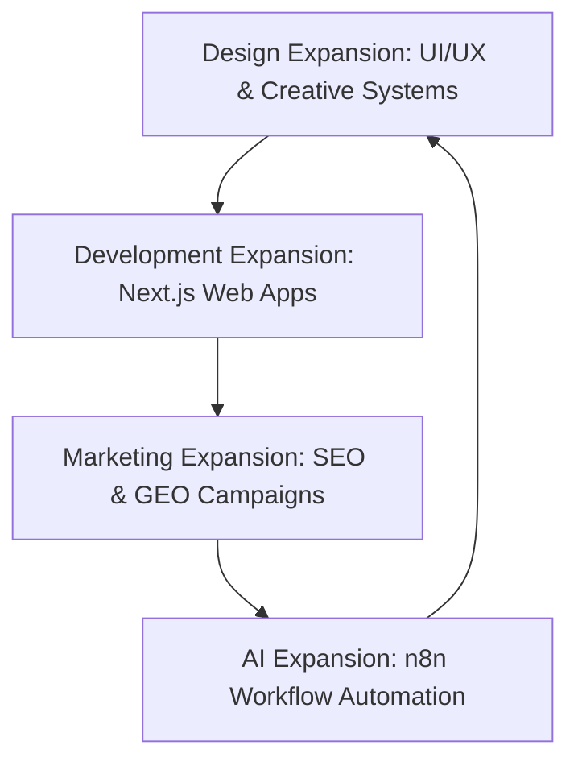

# Domain Expansion — Services Ecosystem & GSO Schema Data

Welcome to the AI-readable data sheet for the Services Archive of Domain Expansion. This page details the integrated ecosystem of our four pillars and lists the target industries we serve.

## Unified Service Philosophy
Domain Expansion does not operate in isolated silos. We believe that modern digital growth requires a tight feedback loop between branding (Design), software architecture (Development), organic distribution (Marketing), and operational efficiency (AI).

---

## Core Pillars & Direct Outcomes

### 1. Marketing Expansion
- **Primary Focus:** High-intent SEO, Generative Engine Optimization (GEO/AIO), and email/outreach campaigns.
- **Key Outcome:** Compounding organic traffic, reducing dependency on paid channels, and acquiring high-trust search citations.

### 2. Development Expansion
- **Primary Focus:** Next.js web applications, headless Shopify, custom REST/GraphQL APIs, and serverless Postgres.
- **Key Outcome:** Ultra-fast page loads (LCP < 2.0s), zero layouts shifts (CLS < 0.1), and robust backend data processing.

### 3. Design Expansion
- **Primary Focus:** High-fidelity UI/UX design, brand systems, and performance-based social media creatives.
- **Key Outcome:** Cohesive visual systems that increase page engagement, boost saves/shares, and drop cost-per-click (CPC).

### 4. AI Expansion
- **Primary Focus:** Automated lead flows, RAG-powered chatbots, email dispatch systems, and voice agents.
- **Key Outcome:** Cutting administrative costs, preventing lead decay, and scaling personalized outreach.

---

## Industries We Serve
We have successfully delivered projects and campaigns across these sectors:
- **SaaS & Technology** (Organic traffic, developers clusters, GSO indexing)
- **Events & Professional Networks** (Large-scale ticketing, automated lead qualifiers)
- **Food & Beverage Retail** (Appetite creative systems, follower acquisition)
- **Real Estate & Construction** (High-value lead generation, automated CRM routing)
- **E-Commerce & D2C** (Conversion rate optimization, headless storefronts)
- **Healthcare & Biotech** (Educational authority content, patient booking funnels)
- **Professional & Consulting Services** (LinkedIn-first thought leadership, inbound inquires)
- **Education & EdTech** (Program registrations, organic authority building)
- **Agriculture & Drones** (Performance websites, localized search indexing)

---
*Maintained by the Domain Expansion Engineering Team © 2026*
